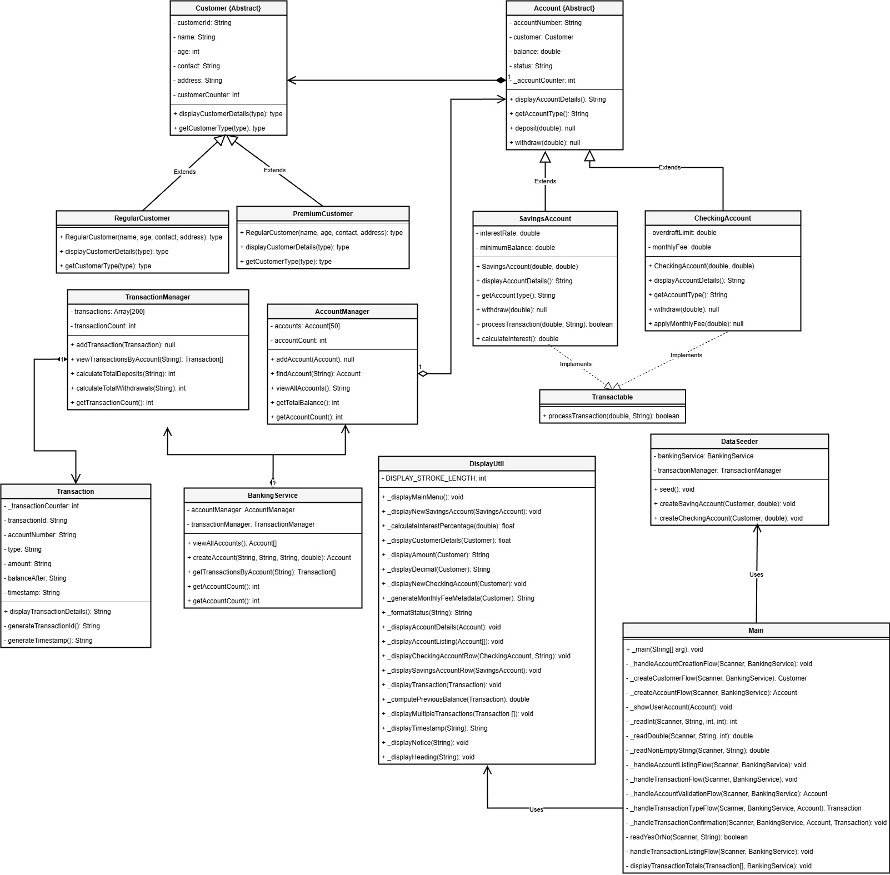

# Banking System Terminal Application

## **Overview**

A Java-based terminal banking application that simulates core banking operations using **object-oriented design** and **layered architecture**. The system supports account management, transaction processing, and reporting, following SOLID principles.

***

## **Design**

### **Architecture**

*   **UI Layer**: Handles user input and menu navigation.
*   **Service Layer (`BankingService`)**: Orchestrates workflows between managers.
*   **Manager Layer**:
    *   `AccountManager`: Stores and manages accounts.
    *   `TransactionManager`: Stores and manages transactions.
*   **Domain Layer**:
    *   `Customer`: Represents customer details.
    *   `Account`: Represents account details and balance.
    *   `Transaction`: Represents deposits and withdrawals.
*   **Utility Layer**:
    *   `DisplayUtil`: Formats and displays data in tables.

### **Class Diagram**


## **Features**

*   Create accounts with customer and account type.
*   Deposit and withdraw funds with confirmation.
*   View all accounts and transaction history in formatted tables.
*   Multi-step flows for account creation and transaction processing.

***

## **How to Run**

1.  **Clone the repository**:
    ```bash
    git clone <repo-url>
    cd BankManagementSystem1
    ```
2.  **Compile the project**:
    ```bash
    javac -d bin @sources.txt
    ```
3.  **Run the application**:
    ```bash
    java -cp bin Main
    ```
4.  **Navigate using menu options**:
    *   `1` → Create Account
    *   `2` → View Accounts
    *   `3` → Process Transaction
    *   `4` → View Transaction History
    *   `5` → Exit

***
